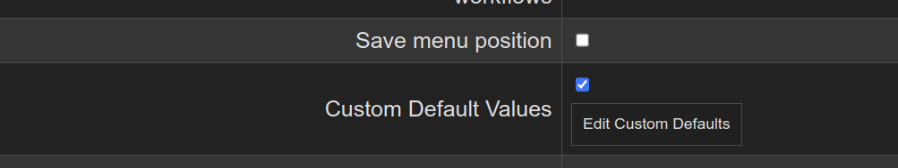

> #### Adds a row to the settings page:

> #### Clicking the `Edit Custom Defaults` button brings up this screen:

The custom defaults will only be applied when adding a node manually. It won't alter nodes loaded from workflows/refreshes or nodes that are copy and pasted.